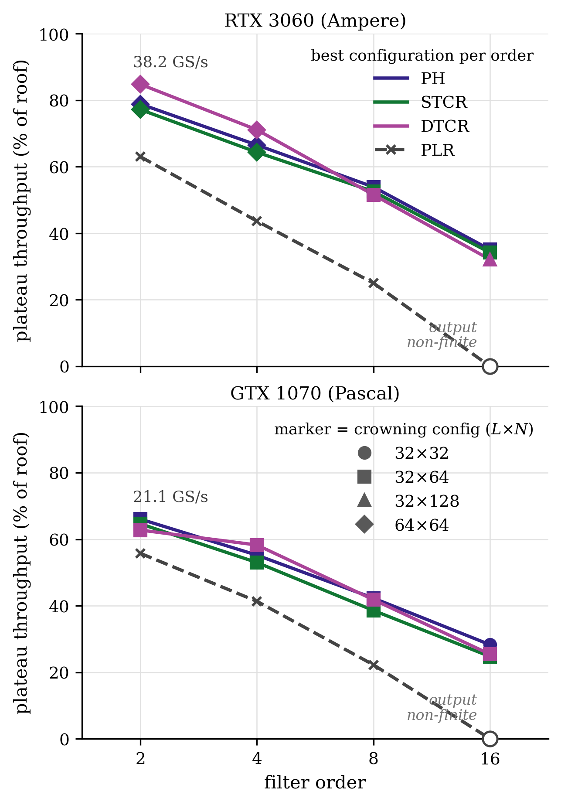

# CUDA Parallel IIR Filter Kernels for Cascaded Biquads

High-performance CUDA kernels for parallel IIR (recursive) filtering of cascaded second-order sections (biquads) on NVIDIA GPUs.

This library accompanies the paper:
> **H. Zhai and B.-P. Paris**, "Parallel Cascaded Recursive Filtering on Multi-Core CPUs and GPUs," to be submitted to *IEEE Transactions on Parallel and Distributed Systems*, 2026.

It is the GPU companion (Part II) of the SIMD/CPU library
[matrix_form_recursive_filtering](https://github.com/Haotian-RA/matrix_form_recursive_filtering) (Part I).

## Overview

Recursive (IIR) filters realized as cascaded biquads pose a fundamental obstacle to parallel computation: every output sample depends on the previous two. This repository provides four GPU realizations of the same filter, spanning the design space from cascaded-form solvers to the literature's direct-form approach:

- **PH factorization** — partial LU decomposition of the block-tridiagonal recurrence; head rows solved via correction vectors.
- **STCR** (single-stage tridiagonal cyclic reduction) — log-depth elimination with both generic loop-form and hand-unrolled *spill-proof* back-substitution kernels, proven bit-identical.
- **DTCR** (decoupled two-sided cyclic reduction) — the first elimination round is fused into the FIR pass; the resulting even/odd halves run concurrently on a `dim3(B, 2)` thread block.
- **PLR** — the literature-faithful direct-form hierarchical merge of Maleki & Burtscher (ASPLOS'18), realizing the entire order-2K filter as one recurrence.

All kernels are single-launch and grid-wide: inter-chunk carries propagate through a **launch-versioned decoupled-lookback protocol** — status flags are relative to a monotone launch index, so the status buffer is zeroed once at allocation and never reset between launches.

## Performance

Measured on **GTX 1070** (Pascal GP104, CC 6.1) and **RTX 3060** (Ampere GA106, CC 8.6), float32, batch sizes 2^16 – 2^25 samples:

<div align="center">
  
</div>

Highlights at saturation (batch 2^25) on the RTX 3060:

| Order | Best cascaded kernel | Throughput | Direct-form PLR |
|---:|---|---:|---:|
| 2  | DTCR (64x64) | **38.4 GS/s** | 28.7 GS/s |
| 4  | DTCR (64x64) | 32.2 GS/s | 19.7 GS/s |
| 8  | PH (32x64)   | 24.5 GS/s | 11.2 GS/s |
| 16 | PH (32x64)   | 15.9 GS/s | fails accuracy gate |

At order 2, DTCR reaches ~85% of the device's ~45 GS/s streaming-bandwidth roof. The cascaded solvers degrade gracefully with filter order and remain numerically robust throughout, while the direct-form realization loses throughput rapidly and fails the accuracy gate at order 16 — a numerical property of the direct form that the CPU emulator predicts before any hardware run.

## Repository Structure

```
├── run_accuracy.sh           # Entry point: accuracy gate for all configured orders
├── run_performance.sh        # Entry point: throughput campaign (+ ptxas register/spill report)
├── include/                  # Kernel headers and support (compiled with -Iinclude)
│   ├── ph_kernels.cuh        # PH factorization kernels
│   ├── stcr_kernels.cuh      # STCR kernels (loop + hand-unrolled back substitution)
│   ├── dtcr_kernels.cuh      # DTCR kernels (two-sided, parity-concurrent)
│   ├── plr_kernels.cuh       # PLR direct-form kernels (Maleki & Burtscher)
│   ├── gpu_specs.hpp         # Hardware profiles + compile-time occupancy math
│   ├── iir_utils.hpp         # Shared host/device utilities
│   └── measure.cuh           # Timing harness
├── src/
│   ├── test_accuracy.cu      # Verifies kernel output against the float64 reference
│   └── test_performance.cu   # Throughput measurement + accuracy verification
├── tools/
│   ├── ref_generate.py       # Filter design (SOS Butterworth) + golden reference
│   ├── stcr_emulator.py      # Float32 CPU emulation of the STCR kernels
│   ├── dtcr_emulator.py      # Float32 CPU emulation of the DTCR kernels
│   └── plr_emulator.py       # Float32 CPU emulation + direct-form numerics analysis
├── notebook/
│   ├── filter_design.ipynb   # Test-filter design and conditioning
│   ├── occupancy.ipynb       # Occupancy model behind gpu_specs.hpp
│   ├── plot_measurements.ipynb # Measurement exploration
│   └── paper_figures.ipynb   # Regenerates figures/ from results/
├── results/                  # Raw campaign tables (.ods), one per GPU
├── figures/                  # Paper figures (PDF for LaTeX + PNG preview)
└── build/                    # Created at run time (git-ignored): reference.bin,
                              # filter_taps.hpp, compiled binary
```

## Dependencies

- **CUDA toolkit** (`nvcc`); tested on compute capability 6.1 (Pascal) and 8.6 (Ampere)
- **Python 3** with `numpy` and `scipy` (reference generation and emulators)
- For the notebooks additionally: `pandas`, `matplotlib`, `odfpy`

No external C++/CUDA libraries are required — the kernels are header-only.

## Quick Start

```bash
./run_accuracy.sh      # verify the configured kernel against the float64 reference, all orders
./run_performance.sh   # throughput campaign (+ per-kernel register/spill report)
```

Both scripts are configured by the variables at their top:

| Variable | Meaning |
|---|---|
| `KERNEL` | `PH`, `STCR`, `DTCR`, or `PLR` |
| `GPU` | `RTX3060` (default) or `GTX1070` — selects the hardware profile in `gpu_specs.hpp` |
| `ORDERS` | Filter orders to sweep (`N_SECTIONS` = order / 2) |
| `BLOCK_SIZE`, `N_BLOCKS` | Thread-block geometry: threads x register-resident samples per thread |
| `HANDUNROLLED` | Use the hand-unrolled spill-proof STCR/DTCR back substitution (32x32, 32x64, 32x128, 64x64) |
| `PLR_X_MAX_*` | PLR values-per-thread ceiling per order; `auto` runs an ascending compile-time spill calibration |

Each order iteration regenerates the test filter: `tools/ref_generate.py` designs a Butterworth lowpass (order `2*N_SECTIONS`, cutoff 0.2 x Nyquist) directly in SOS form and writes `build/filter_taps.hpp` (coefficients compiled into the drivers) and `build/reference.bin` (float64 `sosfilt` golden output). Kernel and reference consume identical float32-rounded coefficients, so coefficient rounding never contaminates the accuracy comparison. Nothing in `build/` is committed — a fresh clone reproduces everything with one script run.

## GPU-Free Validation (Emulators)

Each emulator is a line-faithful float32 CPU re-implementation of the corresponding kernels: warp shuffles become array shifts, thread blocks become lockstep loops, and every operation preserves the device's FMA rounding.

```bash
python3 tools/stcr_emulator.py
python3 tools/dtcr_emulator.py
python3 tools/plr_emulator.py
```

Sample output (`stcr_emulator.py`):

```
order  2: loop==unrolled(N=32): BIT-IDENTICAL | 32x32: rel=2.3e-07 | 32x64: rel=2.3e-07 | 32x128: rel=2.3e-07 | 64x64: rel=2.3e-07
order  4: loop==unrolled(N=32): BIT-IDENTICAL | 32x32: rel=8.3e-07 | 32x64: rel=8.3e-07 | 32x128: rel=8.3e-07 | 64x64: rel=8.3e-07
order  8: loop==unrolled(N=32): BIT-IDENTICAL | 32x32: rel=3.9e-07 | 32x64: rel=3.9e-07 | 32x128: rel=4.1e-07 | 64x64: rel=3.9e-07
order 16: loop==unrolled(N=32): BIT-IDENTICAL | 32x32: rel=4.5e-07 | 32x64: rel=4.5e-07 | 32x128: rel=4.5e-07 | 64x64: rel=4.5e-07
ALL CHECKS PASSED
```

The emulators serve three purposes: (1) they predict the accuracy-gate verdict of every algorithm x geometry x order combination before any hardware run; (2) they prove the loop-form and hand-unrolled back substitutions are **bit-identical**, so validating one covers the other; (3) they enable phase-by-phase debugging when a kernel diverges from the reference — any lane's registers can be inspected at any round.

## Algorithms at a Glance

| Kernel | Form | Parallel strategy | Back substitution | Best regime |
|---|---|---|---|---|
| PH | Cascaded SOS | Partial LU + correction vectors | — | Higher orders |
| STCR | Cascaded SOS | Single-stage cyclic reduction | Loop or hand-unrolled (bit-identical) | Higher orders |
| DTCR | Cascaded SOS | Two-sided CR, parity-concurrent | Loop or hand-unrolled | Low orders / peak throughput |
| PLR | Direct form (order 2K) | Hierarchical merge (ASPLOS'18) | — | Low orders only; numerically fragile |

## Supported GPUs

| GPU | Architecture | CC | SMs | Streaming roof |
|---|---|---:|---:|---:|
| NVIDIA GTX 1070 | Pascal GP104 | 6.1 | 15 | ~32 GS/s |
| NVIDIA RTX 3060 | Ampere GA106 | 8.6 | 28 | ~45 GS/s |

Porting to another GPU requires only adding a hardware profile to `include/gpu_specs.hpp`; the occupancy math and `__launch_bounds__` targets are computed from it at compile time.

## Notebooks

- [paper_figures.ipynb](https://nbviewer.org/github/Haotian-RA/cuda_recursive_filtering/blob/main/notebook/paper_figures.ipynb) — regenerates the paper figures from the raw campaign tables
- [occupancy.ipynb](https://nbviewer.org/github/Haotian-RA/cuda_recursive_filtering/blob/main/notebook/occupancy.ipynb) — the occupancy model behind `gpu_specs.hpp`
- [filter_design.ipynb](https://nbviewer.org/github/Haotian-RA/cuda_recursive_filtering/blob/main/notebook/filter_design.ipynb) — test-filter design and conditioning
- [plot_measurements.ipynb](https://nbviewer.org/github/Haotian-RA/cuda_recursive_filtering/blob/main/notebook/plot_measurements.ipynb) — measurement exploration

## Citation

If you use this code in your research, please cite:

```bibtex
@article{zhai2026gpu,
  author  = {Zhai, Haotian and Paris, Bernd-Peter},
  title   = {Parallel Cascaded Recursive Filtering on Multi-Core CPUs and GPUs},
  journal = {arXiv preprint},
  year    = {2026}
}
```

The citation will be updated once the paper is published.

## License

This project is licensed under the MIT License — see [LICENSE](LICENSE) for details.
